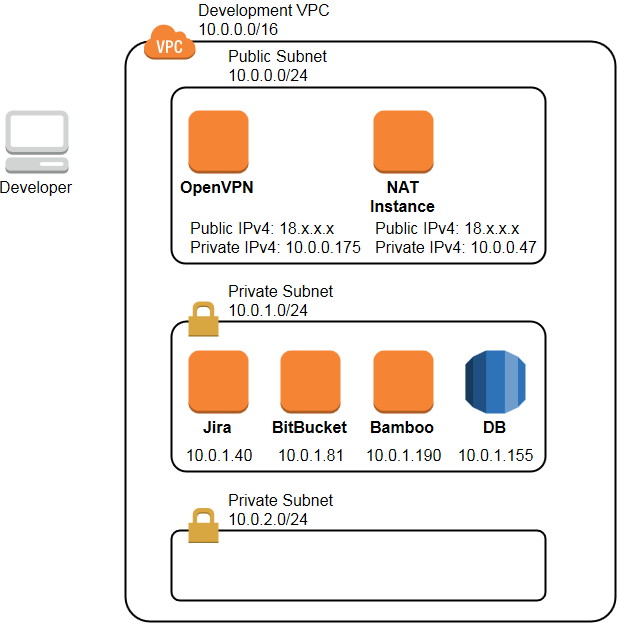

# An example of a CI/CD stack on AWS featuring JIRA, Bitbucket and Bamboo

This is an example of a CI stack build on Amazon Web Services. It's built for a team of one developer and one DevOps engineer.

[JIRA Software](https://www.atlassian.com/software/jira) is used for project and issue tracking,  
[Bitbucket](https://www.atlassian.com/software/bitbucket) is used for git code management,  
[Bamboo](https://www.atlassian.com/software/bamboo) is used for Continuous Integration.  

Here are some features of this stack:
* A user can create issues in JIRA
* A user can pull/push code from/to Bitbucket git repository
* Once code is merged with a project repository, Bamboo runs tests and builds the project
* A user can see project build status
* A user receives email notifications of issue status changes

There are Cloud, Data Center and Server versions to use these products. I bought Server licenses 10$ each.

Here is the architecture diagram:  

JIRA Software, Bitbucket and Bamboo servers are not accessible via Internet, since they are located in a private subnet. To reach the infrastructure developers connect via OpenVPN. Database instance is also located in a private subnet. For the servers in the private subnet to reach Internet a NAT instance is deployed in a public subnet.

Firstly, OpenVPN instance is deployed in a public subnet. I used Bring Your Own License version of the OpenVPN server. It has a limit of two concurrently connected users. An Elastic IP is attached to the OpenVPN server, so its public IP address remains the same across reboots. A separate security group "OpenVPN Access Server SG" is created and attached to this server. This security group allows inbound connections via 1194/udp, 22/tcp, 943/tcp and 443/tcp.

Next, an RDS PostgreSQL instance is deployed in a private subnet. Here at least two private subnets are required for a subnet group. So one more private subnet is created. This database instance has a separate security group "RDS PostgreSQL SG". It allows inbound connections via 5432/tcp from the default security group.

Then, one by one, three EC2 instances with JIRA, Bitbucket and Bamboo are deployed in a private subnet. These applications are linked with each other. Authentication on Bitbucket and Bamboo is configured to use JIRA. To configure email notification Mail Server credentials are needed. AWS has Simple Email Service (SES). New account is created and the applications are configured.

