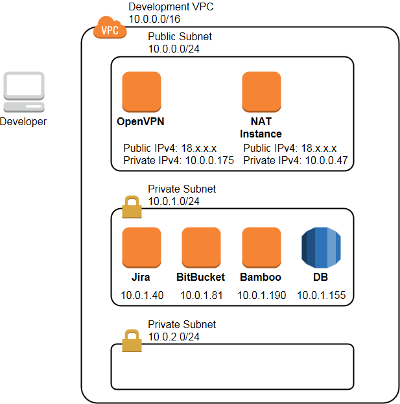

# An example of a CI/CD stack on AWS featuring JIRA, Bitbucket and Bamboo
> You can download lab supporting materials with the following command:
```shell extension
$ git clone https://github.com/aydarsh/AWSDevOpsLabs.git
$ cd AWSDevOpsLabs/
```

This is an example of a CI stack build on Amazon Web Services.

[JIRA Software](https://www.atlassian.com/software/jira) is used for project and issue tracking,

[Bitbucket](https://www.atlassian.com/software/bitbucket) is used for git code management,

[Bamboo](https://www.atlassian.com/software/bamboo) is used for Continuous Integration.

There are Cloud, Data Center and Server versions to use these products. I bought Server licenses 10$ each.

Here is the architecture diagram:


 
